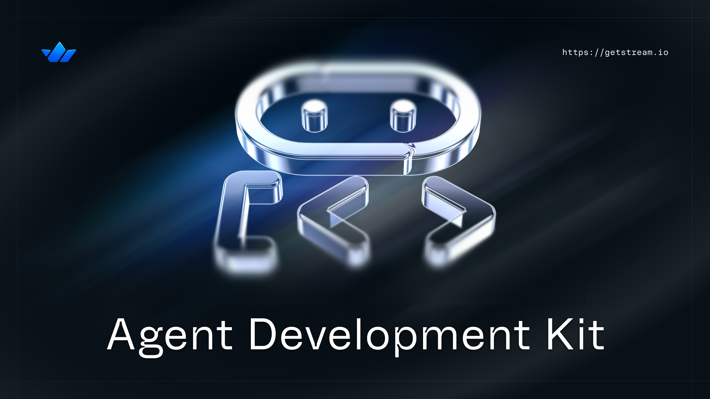

### Find the accompanying article here: **[Exploring Google's Agent Development Kit](https://getstream.io/blog/exploring-google-adk/)**

This repository contains sample code demonstrating how to use Google's Agent Development Kit (ADK) to build, orchestrate, and evaluate AI agents powered by large language models (LLMs).

## Stream Chat AI Integration

<div style="display: flex; align-items: center;">
  
  <div>
    <strong><a href="https://getstream.io/chat/?utm_source=github&utm_medium=referral&utm_content=&utm_campaign=devenossproject">Stream Chat</a></strong> allows easy-to-build <strong><a href="https://getstream.io/chat/solutions/ai-integration/?utm_source=github&utm_medium=referral&utm_content=&utm_campaign=devenossproject">AI Integrations</a></strong> in all Chat SDKs.<br/>
    If you're interested in building powerful real-time messaging with LLM integration, check out the <strong><a href="https://getstream.io/chat/sdk/?utm_source=github&utm_medium=referral&utm_content=&utm_campaign=devenossproject">Stream SDKs for Chat</a></strong>!
  </div>
</div>

## What is ADK?

The [Agent Development Kit (ADK)](https://google.github.io/adk-docs/) is an open-source framework designed to make it easier to build, orchestrate, and evaluate agents powered by [large language models (LLMs)](https://getstream.io/blog/best-local-llm-tools/). ADK offers developers a structured way to compose agents that can interact with tools, communicate with each other, and reason about their actions—all while integrating with Google's own Gemini models or other LLMs.

## Getting Started

### Prerequisites

- Python 3.10+
- Access to Google Gemini models (API key)

### Installation

```bash
# Clone this repository
git clone https://github.com/yourusername/adk-samples.git
cd adk-samples

# Create virtual environment
python -m venv venv
source venv/bin/activate  # On Windows: venv\Scripts\activate

# Install dependencies
pip install -r requirements.txt

# Set up environment variables
cp .env.example .env
# Edit .env with your actual API key
```

### Configuration

This project uses environment variables for configuration, which helps prevent accidental exposure of API keys in source control.

1. Create a `.env` file in the project root (it's already in `.gitignore`)
2. Add your configuration variables:

```
# Required
GOOGLE_API_KEY=your_actual_api_key_here

# Optional (defaults shown)
DEFAULT_MODEL=gemini-2.0-flash
DEFAULT_APP_NAME=my_adk_app
DEFAULT_USER_ID=default_user
DEFAULT_SESSION_ID=default_session
```

All samples import this configuration from the root `config.py` file, which loads these environment variables using the `python-dotenv` package.

## Sample Overview

This repository contains several examples showing different aspects of ADK:

1. **Basic Agents**: Simple examples of various agent types
   - [LLM Agent](samples/01_llm_agent/): Basic LLM-driven agent
   - [Sequential Agent](samples/02_sequential_agent/): Pipeline of multiple agents
   - [Parallel Agent](samples/03_parallel_agent/): Agents running concurrently
   - [Loop Agent](samples/04_loop_agent/): Iterative agent execution
   - [Nested Agents](samples/05_nested_agent/): Agent-as-a-tool pattern

2. **Tools**: Examples of different tool implementations
   - [Basic Tools](samples/06_basic_tool/): Simple function tools
   - [Context Access](samples/07_tool_context/): Tools with context access
   - [Tool Composition](samples/08_tool_composition/): Tools using other tools

3. **Orchestration**: Complex agent workflows
   - [Document Processing](samples/09_doc_processing/): Multi-stage document workflow
   - [Research Pipeline](samples/10_research_pipeline/): Parallel research with merging
   - [Content Refinement](samples/11_content_refiner/): Iterative content improvement

4. **Deployment**: Running agents in production
   - [REST API](samples/12_rest_api/): FastAPI wrapper
   - [Scheduled Agent](samples/13_scheduled_agent/): Time-based execution
   - [Docker Setup](samples/14_docker/): Containerization example

5. **Responsible Design**: Building trustworthy agents
   - [Safety Checks](samples/15_safety_checks/): Input validation and safety guardrails
   - [Human-in-the-Loop](samples/16_human_approval/): Human approval workflows
   - 
## Acknowledgements

These samples are based on Google's [ADK documentation](https://google.github.io/adk-docs/) and are designed for educational purposes.
